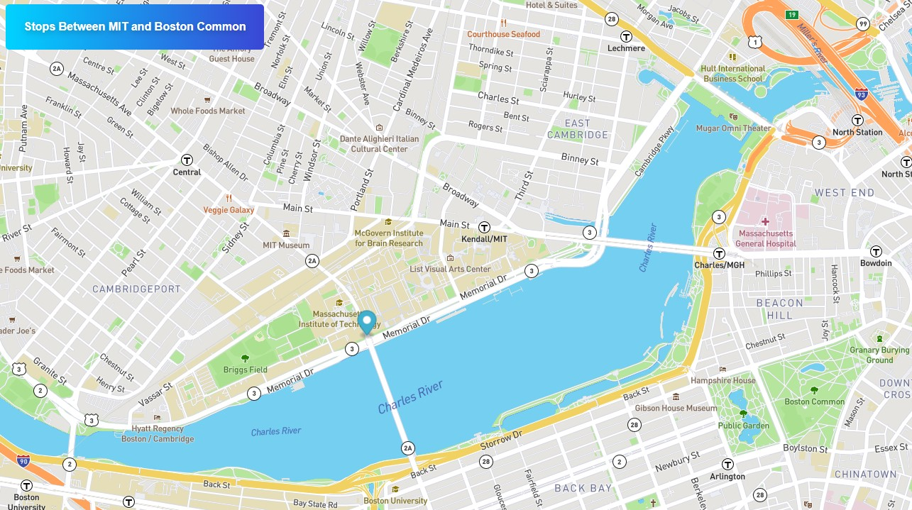

# Real Time Bus Tracker

This project was part of the course work required in the MIT xPRO Full-Stack development course.

The Real Time Bus Tracker shows the animation of the real route of the Red Line moving from MIT to Boston Common. The program utilizes JavaScript and Mapbox API, along with HTML and CSS, to render and manipulate a map on a webpage. 

Clicking on the button in the top left of the page starts the animation. 

## How To Run

Download index.html, styles.css and mapanimation.js files by clicking the green code button. Make sure to save them to the same directory on your computer. Load the index.html file into your browser. Press the button to see the marker move along the route from MIT to Boston Common.

You can also interact with the page without having to download the files. 

<a href="https://leahselig.github.io/RealTimeBusTracker/"> Try It Out Here! </a>

## Roadmap

- [ ] Add additional layers to change between different views like on google maps

- [ ] Allow for other modes of transportation to be tracked

## MIT License

Copyright (c) 2022 MIT

Permission is hereby granted, free of charge, to any person obtaining a copy of this software and associated documentation files (the "Software"), to deal in the Software without restriction, including without limitation the rights to use, copy, modify, merge, publish, distribute, sublicense, and/or sell copies of the Software, and to permit persons to whom the Software is furnished to do so, subject to the following conditions:

The above copyright notice and this permission notice shall be included in all copies or substantial portions of the Software.

THE SOFTWARE IS PROVIDED "AS IS", WITHOUT WARRANTY OF ANY KIND, EXPRESS OR IMPLIED, INCLUDING BUT NOT LIMITED TO THE WARRANTIES OF MERCHANTABILITY, FITNESS FOR A PARTICULAR PURPOSE AND NONINFRINGEMENT. IN NO EVENT SHALL THE AUTHORS OR COPYRIGHT HOLDERS BE LIABLE FOR ANY CLAIM, DAMAGES OR OTHER LIABILITY, WHETHER IN AN ACTION OF CONTRACT, TORT OR OTHERWISE, ARISING FROM, OUT OF OR IN CONNECTION WITH THE SOFTWARE OR THE USE OR OTHER DEALINGS IN THE SOFTWARE.
